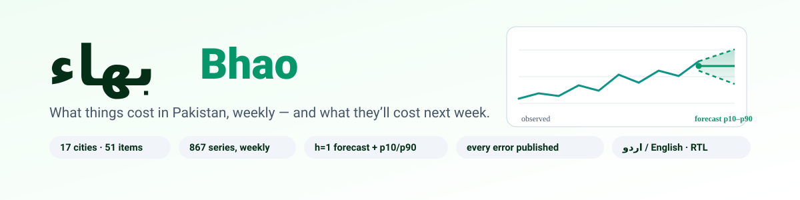
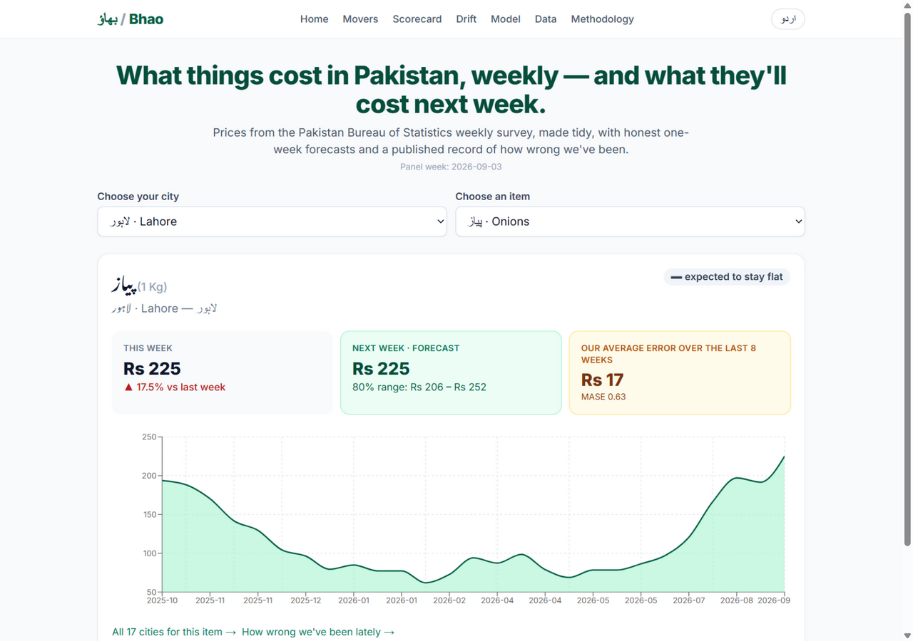
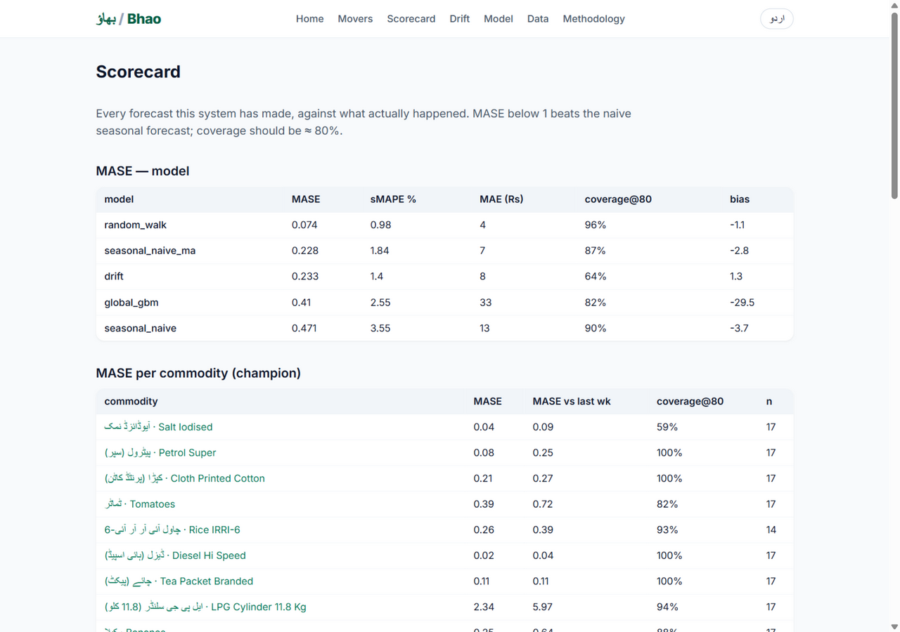
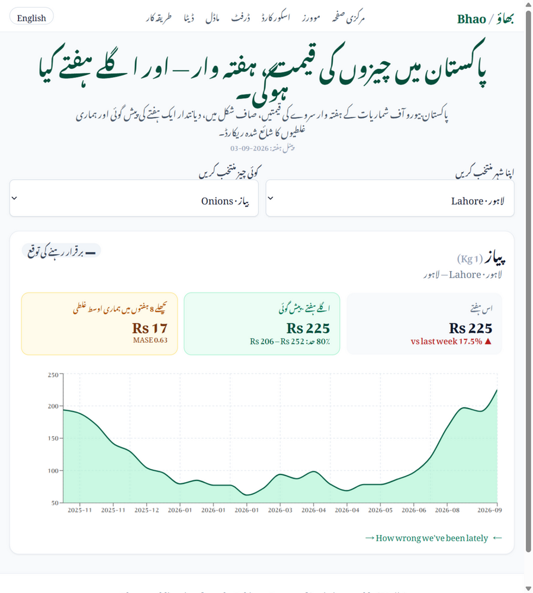
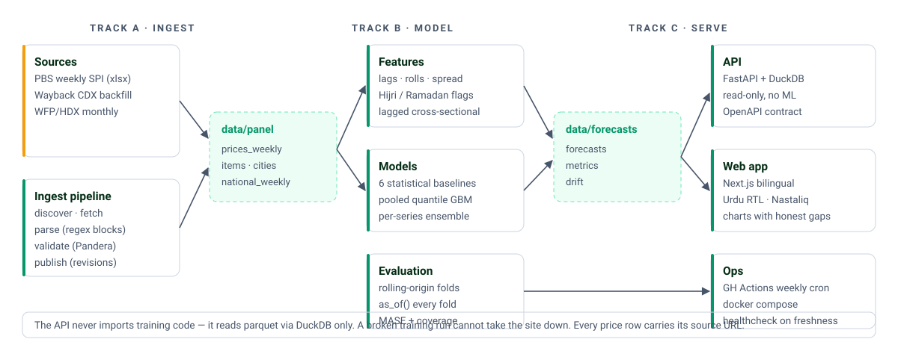

<div align="center">

<picture>
  <source media="(prefers-color-scheme: dark)" srcset="docs/assets/banner-dark.svg">
  
</picture>

[](https://github.com/HasnatKhan010/bhao/actions/workflows/ci.yml)
[](https://github.com/HasnatKhan010/bhao/actions/workflows/weekly.yml)
[](https://www.python.org/)
[](#licence)
[](https://github.com/astral-sh/ruff)
[](#how-to-run)

**What things cost in Pakistan, weekly — and what they'll cost next week.**
بھاؤ — the everyday Urdu word for the going rate.

[Scorecard](#results--the-honest-numbers) · [Architecture](#architecture) · [Dataset](#dataset-download-and-citation) · [API](#api-reference) · [Methodology](#methodology)

</div>

---

Bhao scrapes the Pakistan Bureau of Statistics weekly retail price survey, turns it
into the tidy panel nobody publishes, forecasts next week's price for every
city × commodity pair with prediction intervals, watches its own accuracy for drift,
retrains and re-promotes itself through a gated champion–challenger process, and
serves all of it through a bilingual Urdu/English web app, a public API, and an open
dataset — alongside a **scorecard of every forecast it has ever gotten wrong**.

| | |
|---|---|
| **17 cities · 51 commodities · 867 series** | the full PBS weekly SPI basket, tidied |
| **every row carries its `source_url`** | any cell traces back to the original spreadsheet |
| **27 of 86 Thursdays recovered** | the rest are published as gaps, never interpolated |
| **Champion: random walk (honest)** | the GBM is re-evaluated weekly as the panel deepens |

## Results — the honest numbers

Rolling-origin backtest (5 scorable folds of the 27-week panel, h=1 week, 867
series; MASE denominator = in-sample one-step seasonal-naive MAE on each fold's
*own training portion*; season falls back to lag-4 because the panel is shorter
than 2×52 weeks). Both denominator readings are reported — see the note below.

| Model | MASE (vs snaive-4) | MASE (vs last week) | sMAPE | MAE (Rs) | coverage@80 |
|---|---|---|---|---|---|
| **Random walk — champion** | **0.321** | **0.557** | **2.12%** | **Rs 10.74** | **88.3%** |
| Drift (trend) | 0.468 | 0.850 | 2.64% | Rs 14.51 | 59.1% |
| Global LightGBM | 0.665 | 1.136 | 3.10% | Rs 20.62 | 77.9% |
| Seasonal naive MA (4wk) | 0.703 | 1.220 | 4.02% | Rs 17.41 | 68.5% |
| Seasonal naive | 1.017 | 1.810 | 6.31% | Rs 23.68 | 77.1% |

> **Read the honest row, not the flattering one.** Weekly retail prices are close
> to a random walk — and on this panel the random walk *wins*. The global GBM
> beats seasonal-naive but loses to the random walk; that is published, not
> hidden, and the promotion log says so in English on `/model`. The lag-52-style
> denominator is inflated by ~9% headline YoY inflation (onions were +125.86%
> YoY in the verified week), so the "vs last week" column is the bar that is
> genuinely hard to beat.

## See it

Real data, real app — the forecast and *how much to trust it* always arrive together.

| Home — two taps to an answer | Live scorecard |
|---|---|
|  |  |

| اردو — real RTL, not a CSS flip |
|---|
|  |

## Architecture

<picture>
  <source media="(prefers-color-scheme: dark)" srcset="docs/assets/architecture-dark.svg">
  
</picture>

Three tracks, three contracts, one-way data flow. The API never imports training
code — it reads parquet via DuckDB and nothing else, so a broken training run
cannot take the site down.

## The data problem

PBS publishes 17 cities × 51 commodities, min/avg/max, as **merged-cell Excel with
three header rows**, cities laid out as **vertical blocks of seven**, city names
embedded as `Islamabad (01)`, units as free text (`20 Kg`, `MMBTU`, `Per Plate`),
and a filename convention that has changed at least twice
(`SPI-Report-` → `3.-SPI-Report-`).

<details>
<summary><b>What the parser has to survive</b> (click to expand)</summary>

- **Discovery tries three strategies per week** — live sitemap, constructed URL,
  Wayback CDX — and logs which one won, because the naming drifts.
- **City blocks are found by regex on the `(NN)` suffix, never by row number**, so
  a layout change fails loudly instead of silently shifting every price one
  commodity down; a national-vs-city cross-check (within 30%) is the assertion
  that catches exactly that.
- PBS prints `-` **and sometimes `0`** for "no quote" (verified: Rice IRRI-6 in
  Gujranwala/Sialkot/Lahore, Oct 2025–Jan 2026). Both become nulls. Nulls stay null.
- PBS **restates figures**; revisions are appended, never overwritten, and every
  backtest fold trains through a revision-aware `as_of()` filter — the model is
  only ever evaluated against what was knowable at forecast time.
- **Coverage: 27 of 86 Thursdays recovered** (2025-10-30 → 2026-09-03), 23,409
  rows. The other 59 are published as gaps in `coverage_report.csv`. A short
  panel is a constraint, not a scandal.

</details>

## Drift and retraining

Two channels, because either alone gives false confidence: **feature drift**
(PSI/KS on the model's inputs) and **residual drift** (rolling MASE of the live
champion with a 2-week rule, Page–Hinkley change-point, and a coverage gap on the
80% intervals).

On the first real scoring pass the detector found genuine movement — PSI 0.134
(warn) on the volatility-ratio feature and KS firings on five features, consistent
with onions moving +25% in a single week. Every row, fired or not, lands in
`drift.parquet` with a note a journalist could quote. The detector is validated
against a planted variance regime shift in the fixture suite (potatoes, σ×4 from
week 100 — it fires).

Retraining triggers on a `critical` drift row or a 4-week staleness floor.
Promotion needs a 3% relative MASE margin, no category regressing more than 10%,
coverage in [0.72, 0.88], and no drop in the share of series beating
seasonal-naive — and every decision, including every rejection, is logged in
English.

## How to run

```bash
git clone https://github.com/HasnatKhan010/bhao && cd bhao
make install       # python 3.11 venv + all deps
make fixtures      # regenerate the deterministic fixture set (seed 20260824)
make test          # 152 tests: contracts, pathologies, leakage, parsers, api, drift
```

<details>
<summary><b>Live data, API, web, Docker</b> (click to expand)</summary>

```bash
make spike         # live data-source verification (network)
make weekly        # scrape → validate → publish → score → drift → forecast
make backfill      # one-off Wayback historical backfill + coverage report

make api           # FastAPI on :8000   (BHAO_DATA_DIR=data for the real panel)
make web           # Next.js on :3000

docker compose -f docker/compose.yml up   # both + data volume
```

Point `BHAO_DATA_DIR` at `contracts/fixtures` to develop against synthetic data —
the app shows a visible banner whenever it is serving fixtures, so an invented
price can never pass for a real one.

</details>

## API reference

Auto-documented at `/api-docs` (OpenAPI at `/api/openapi.json`). Read-only, no
auth, rate-limited 60 req/min/IP (5/min on CSV export), CORS open,
`Cache-Control: 1h`:

`/api/health` · `/api/cities` · `/api/items` · `/api/prices` · `/api/forecast` ·
`/api/movers` · `/api/scorecard` · `/api/drift` · `/api/model` ·
`/api/download/panel.parquet` · `/api/download/panel.csv`

`/api/forecast` ships the prediction **and** its trustworthiness together: the 80%
range, the direction (decided against the series' own recent error — never a fixed
percentage), and `recent_error`. The UI cannot show one without the other.

## Dataset download and citation

<a href="https://github.com/HasnatKhan010/bhao/releases/latest/download/panel.parquet"></a>
<a href="https://github.com/HasnatKhan010/bhao/releases/latest/download/panel.csv"></a>
<a href="https://github.com/HasnatKhan010/bhao/releases/latest/download/coverage_report.csv"></a>

Every price carries the exact `source_url` it came from and the `ingested_at`
timestamp, so any cell can be traced to the original spreadsheet.

> Bhao. (2026). *Pakistan weekly retail prices (panel)*. Source: Pakistan Bureau
> of Statistics, Weekly Sensitive Price Indicator.

WFP/HDX monthly prices (2004–2026) are used for long-history validation. **That
dataset was packaged by someone else**; the scraping claim is about PBS only.

## Methodology

The [methodology page](web/messages/en.json · rendered at `/methodology`) states
the limits unprompted — the same limits apply here:

<details>
<summary><b>Honest limitations</b> (click to expand)</summary>

1. **h=1 week only.** No claim beyond one week.
2. **Coverage is what PBS surveyed** — 17 cities, 51 retail commodities. Not a
   national average of all prices, not a CPI substitute.
3. **The panel starts where the archive starts.** 27 of the last 86 Thursdays are
   recoverable; the coverage report publishes exactly which weeks are missing.
4. **No causal claims.** Correlates and lags only.
5. **Administered prices are policy events** (petrol, diesel, electricity, gas);
   metrics are reported split on that flag.
6. **Not advice.** Forecasts are model output with published error rates.
7. **Revisions exist** and are kept; the backtest is evaluated against what was
   knowable at forecast time.
8. **The champion is currently the random walk.** The GBM does not yet beat it on
   this panel; that is published, not hidden.

</details>

## Licence

MIT. Data: Pakistan Bureau of Statistics (public official statistics, attributed
per row; `robots.txt` permissive, 1 request per 2 s, everything cached) and
WFP/HDX (used under its own licence, attributed, labelled as an existing dataset).

<div align="center">
<sub>بھاؤ — built because nobody had packaged this data, and somebody should have.</sub>
</div>
